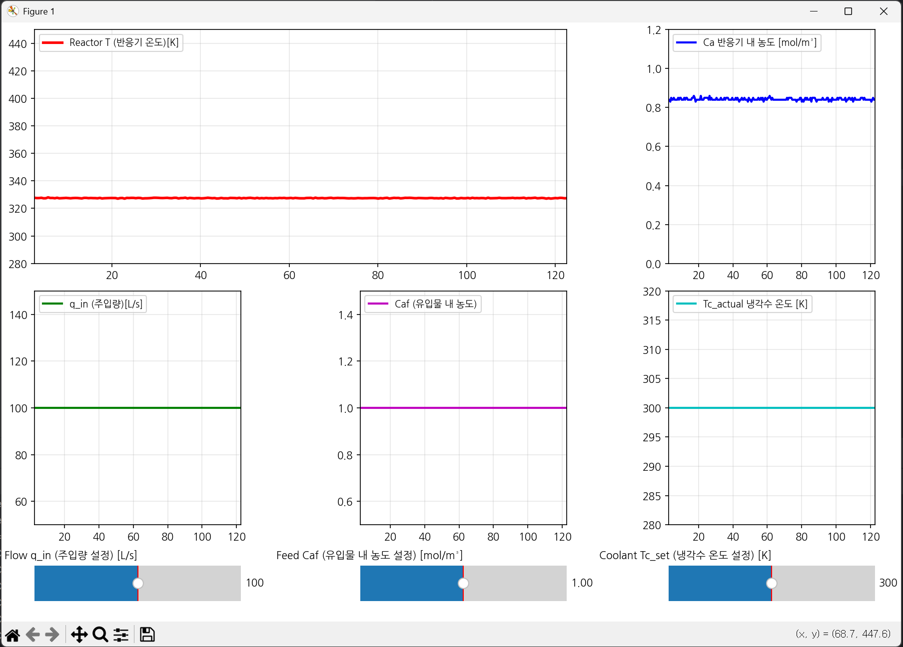

# Introduction
This is a simple CSTR (Continuous Stirred-Rank Reactor) Simulator 

## This Simulator consists of two python files. 

sim_server.py : Simulator + Simple Modbus Server 

hmi_client.py : HMI + Simple Modbus Client 

### 적분기: Solve_IVP 사용  
### 변화율 계산 함수 : ode_rhs( **O**rdinary **D**ifferential **E**quation - **R**ight **H**and **S**ide) 를 이용해서 연속 공정 시뮬레이션 

### 변수 정의

Ca
: 반응기 내 반응물 A의 농도 (concentration_Ca)

T
: 반응기 온도 (temperature_T)

r 
: 반응 속도 (reaction_rate)

q 
: 유입 유량 (flow_rate_lps)

V 
: 반응기 부피 (CSTR_VOLUME_M3)

Caf
: 유입물 내 A의 농도 (feed_concentration_molm3)

Tf
: 유입물 온도 (FEED_TEMPERATURE_K)

Tc
: 냉각수 온도 (coolant_temp_k)

k0
: 반응 속도 상수 전인자 (ARRHENIUS_PREEXP)

E/R 
: 활성화 에너지 / 기체 상수 (ARRHENIUS_E_OVER_R)

−ΔHr
  : 반응 엔탈피 (REACTION_ENTHALPY_KJ_M)

ρ 
: 밀도 (LIQUID_DENSITY_KG_M3)

Cp
  : 비열 (HEAT_CAPACITY_KJ_KG_K)

UA 
: 총괄 열전달 계수 × 면적 (U_A_J_PER_S_K)

### 변화율 계산 함수 내부 로직 

**축적량 = 유입량 - 유출량 + 생성령 - 소모량**
- **축적량**: `(시간 t+Δt에서의 총량) - (시간 t에서의 총량)`
- **유입량**: `(유입 농도) * (유량) * (시간)`
- **유출량**: `(유출 농도) * (유량) * (시간)`
- **소모량**: `(반응 속도) * (부피) * (시간)`
- `V * Ca(t+Δt) - V * Ca(t) = (q*Caf - q*Ca - V*r) * Δt`
- `(Ca(t+Δt) - Ca(t)) / Δt = (q/V)*(Caf - Ca) - r`
- `dCa/dt = (q/V)*(Caf - Ca) - r`

**에너지 축적량 (Accumulation) = 에너지 유입량 (In) - 에너지 유출량 (Out) + 에너지 생성량 (Generation) - 에너지 소모량 (Consumption)**
- **축적량**: `(시간 t+Δt의 총에너지) - (시간 t의 총에너지)`
- **유입량 (흐름)**: `(유량) * (밀도) * (비열) * (유입 온도) * (시간)`
- **유출량 (흐름)**: `(유량) * (밀도) * (비열) * (유출 온도) * (시간)`
- **생성량 (반응열)**: `(반응 속도) * (부피) * (반응 엔탈피) * (시간)`
- **소모량 (냉각)**: `(열전달량) * (시간)`
- `VρC_p * (T(t+Δt) - T(t)) = (qρC_pT_f - qρC_pT + rV(-ΔH_r) - UA(T - T_c)) * Δt`
- `(T(t+Δt) - T(t)) / Δt = (q/V)*(T_f - T) + (r(-ΔH_r))/(ρC_p) - (UA(T - T_c))/(VρC_p)`
- `dT/dt = (q/V)*(T_f - T) + ((-ΔH_r) / (ρC_p))*r + (UA / (VρC_p))*(T_c - T)`

In Attack Scenario,
  If Jacket Water (Coolant) 300 K -> 305K for a few seconds, The system will fall out of equilibrium.

# Execution Example. 
## Normal 

## Attack 

