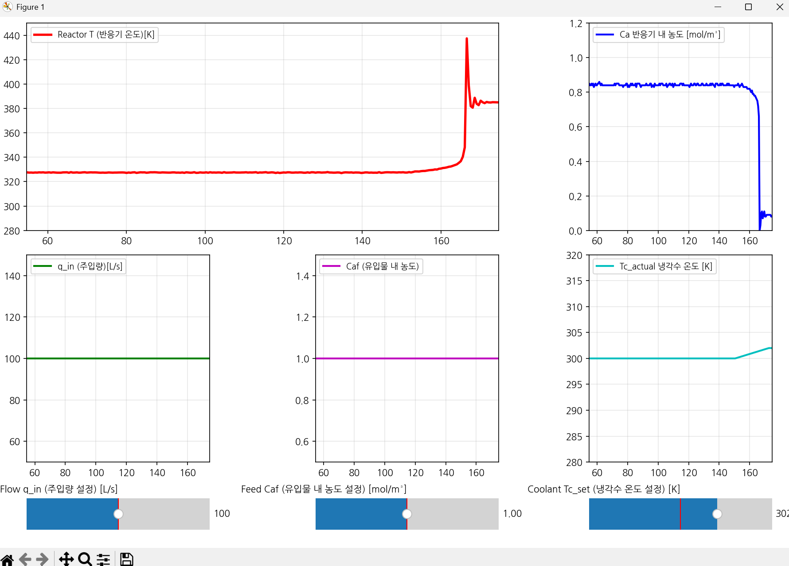

# Introduction
This is a simple CSTR (Continuous stirred-tank reactor) Simulator 

In the python code(cstr_test.py), there are two treads .
- One is simulation_loop
- Other one is ui_loop

In Attack Scenario, 
  If Jacket Water 300 K -> 305K for a few seconds, The system will fall out of equilibrium.

# Execution Example. 
## Normal 

## Attack 

